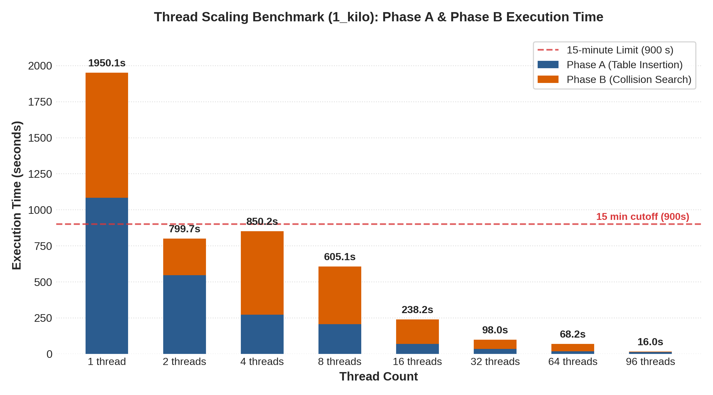

# CITS3402 Assignment 1 Report

| Yashwardhan Laharia | 24295462 |
| --- | --- |

## 1. Introduction

This project demonstrates my attempt at a birthday attack against the supplied 48-bit
toy hash: it stores file-A hashes, searches file B for a match, and
parallelises the search with OpenMP using partitioned open-addressing tables
and per-partition locks during insertion.

## 2. Birthday-Attack Algorithm

Assuming independent, approximately uniform outputs, sets containing $N_A$
and $N_B$ hashes have cross-match probability
$1-e^{-N_A N_B/2^{48}}$. Equal sets reach 50% probability at
$N_A=N_B=\sqrt{\ln(2)2^{48}}\approx1.40\times10^7$, or about
$2.79\times10^7$ total hashes. This is a probabilistic expectation and not a
fixed amount of work: the first matching pair depends on the input files and,
in the parallel case, on which scheduled chunk finds a match first.

Phase A inserts `(hash, nonce_a)` pairs into a collision table. Phase B
generates `(hash, nonce_b)` pairs and queries that table. A match supplies the
two candidate nonces, which the caller independently verifies before writing
either solved file.

**Collision table:** Each open-addressing entry stores a hash, its file-A
nonce, and an occupancy flag. A multiplicative index is masked by
`capacity - 1`, so capacities are powers of two; collisions use linear
probing. The serial table has $2^{25}$ entries for $2^{24}$ A trials, limiting its
planned load to 50% and reducing probe lengths.

**Search ranges:** Phase A hashes nonces zero through $2^{24} - 1$. With that
table, the expected B probes before a match are $2^{24}$, giving approximately
$2^{25}$ total hash calls under the uniform-output model. Phase B searches in
consecutive $8 \times 2^{24}$-nonce batches while reusing the A table. The first
batch has expected cross-match count eight and success probability
$1-e^{-8}=99.97\%$; if needed, the next non-overlapping batch is searched.

## 3. Parallelisation and Synchronisation

The serial attack is the correctness and speedup baseline. The OpenMP version
parallelises independent nonce trials rather than the sequential operations
inside each toy hash call.

**Work assignment:** Phase A uses `omp for schedule(static)`, assigning each
nonce once. Phase B uses `schedule(guided)` over fixed $2^{16}$-nonce chunks.
The chunk size limits how much extra work can be performed after another
thread finds a collision. Hashes are routed to one of `T` partitions using
`hash % T`, where `T` is the actual OpenMP team size. Each partition is sized
to the next power of two at least twice its expected share of A hashes.

**Synchronization:** During Phase A, one OpenMP lock per partition protects
entries and the partition's entry count. The locks are padded to 64 bytes so
locks for different partitions do not share a cache line. A barrier completes
every insertion before Phase B, when the tables are read-only and require no
locks. A C11 atomic compare-and-exchange on `found` selects exactly one thread
to publish the solution; completion of the parallel region synchronizes that
result with the caller.

**Rationale:** Partitioning gives one deterministic phase-B lookup instead of
searching `T` thread-owned tables. Per-partition locks avoid one global critical
section, although phase-A hashes targeting the same partition can contend.
Static scheduling has low overhead in Phase A because trials perform similar
work. Guided scheduling in Phase B balances the chunk-level work while still
allowing the search to stop after a collision.

**Termination:** Phase B assigns fixed $2^{16}$-nonce chunks. Threads check the
atomic `found` flag before starting each chunk. If a collision is found while
chunks are already in progress, those chunks continue to completion; chunks
not yet started can be skipped. After the worksharing barrier, one thread sets
`stop_search`, and the implicit `single` barrier ensures that all threads leave
the batch consistently without starting another batch.

## 4. Memory Usage and Trade-offs

The table dominates memory use. On the target 64-bit build, alignment makes
each entry 24 bytes. The serial $2^{25}$-entry table therefore occupies
805,306,368 bytes (768 MiB), excluding two working PDF copies.

In parallel, each of `T` partitions has capacity
`next_power_of_two(2 * ceil(2^24 / T))`. At 96 threads this is $2^{19}$ entries
per partition, or 1.125 GiB of table storage. Each thread also owns two PDF
buffers, making file size relevant to total memory.

The 50% planned load spends memory to shorten linear probes. Partition locks
add Phase A synchronization but enable one lock-free Phase B lookup. Reusing
the A table for further B batches increases search time without increasing
table memory. Under the approximately uniform hash-output assumption used by
the birthday-attack analysis, `hash % T` is expected to distribute entries
evenly across partitions. This allows fixed-capacity partitions and separate
locks without dynamic rebalancing, while retaining the memory cost of the
50% load target.

## 5. Performance Results and Analysis

The reported time covers the attack routine, including table setup and cleanup,
but excludes input loading, final verification, and output writing. Experiments
were run on Kaya's `cits3402` partition with GCC 14.3.0 and OpenMP at `-O3`.
The completion benchmark used 96 threads on an exclusive node. For scaling,
each configuration ran on a single node. The runs with 16, 32, 64, and 96
threads requested exclusive nodes; the runs with 1, 2, 4, and 8 threads did
not, avoiding reservation of a full node for these low-thread-count runs.
Each configuration was run three times, and the tables report arithmetic means
of the recorded timings.

### 5.1 Completion Results

The completion table reports the mean of three runs at 96 threads. Phase A,
Phase B, and total times are measured by the program. The maximum individual
total is included for the 15-minute check.

| Pair | Phase A Mean (s) | Phase B Mean (s) | Total Mean (s) | Maximum Total (s) |
| --- | ---: | ---: | ---: | ---: |
| `1_kilo` | 11.72 | 4.27 | 16.11 | 16.12 |
| `2_mega` | 22.94 | 25.41 | 48.47 | 48.49 |
| `3_giga` | 39.82 | 14.80 | 54.75 | 54.75 |
| `4_tera` | 59.50 | 22.17 | 81.81 | 81.82 |
| `5_peta` | 84.81 | 158.20 | 243.14 | 243.17 |
| `6_exa` | 158.83 | 415.98 | 574.95 | 575.49 |

### 5.2 Scaling Results

The thread-scaling experiment uses the `1_kilo` pair and three sequential
repetitions at each thread count. The table reports arithmetic means in
seconds. Phase A is a fixed $2^{24}$-trial workload; total time is not fixed
work because Phase B stops at the first collision.

| Threads  $p$ | Phase A Mean (s) $A_p$ | Phase B Mean (s) | Total Mean (s)  $T_p$ | Phase A Speedup $S_A=A_1/A_p$ | Total Speedup $S_{\mathrm{total}}=T_1/T_p$ | Phase A Efficiency $E_A=(S_A/p)\times 100$ |
| ---: | ---: | ---: | ---: | ---: | ---: | ---: |
| 1 | 1082.85 | 867.23 | 1950.13 | 1.00 | 1.00 | 100.0 |
| 2 | 545.35 | 254.31 | 799.73 | 1.99 | 2.44 | 99.3 |
| 4 | 271.11 | 579.09 | 850.26 | 3.99 | 2.29 | 99.9 |
| 8 | 206.44 | 398.70 | 605.20 | 5.25 | 3.22 | 65.6 |
| 16 | 68.61 | 169.58 | 238.27 | 15.78 | 8.18 | 98.6 |
| 32 | 34.42 | 63.55 | 98.04 | 31.46 | 19.89 | 98.3 |
| 64 | 17.31 | 50.86 | 68.25 | 62.54 | 28.57 | 97.7 |
| 96 | 11.72 | 4.26 | 16.10 | 92.38 | 121.13 | 96.2 |

### 5.3 Analysis

**Parallel Scaling and Efficiency:**
Phase A performs exactly $2^{24}$ hash operations in a successful run, thus
it provides the clearest fixed-work measure of parallel speedup and efficiency. As shown in Table 5.2, Phase A
shows strong scaling up to 96 threads, achieving a 92.38x speedup and 96.2%
parallel efficiency. Across most core allocations,
partition-level locking introduces negligible overhead.
The prominent anomaly occurs at 8 threads, where efficiency drops sharply to 65.6% (5.25x speedup)
accompanied by high run-to-run variance. I did not request exclusive nodes for runs below 16 threads; shared-node contention _may_ have
contributed rather than an algorithmic lock bottleneck.

**Total Runtime and Search Variability:**
In contrast to Phase A, total attack time encompasses early-exit termination
in Phase B. When an active thread locates a collision, pending iterations
complete their $2^{16}$-nonce chunks before halting, but remaining batches
are skipped. Consequently, total-time ratios reflect both thread throughput
and the statistical fortune of when a collision appears within the search
space. This variable exit depth explains why 2 threads outpaced 4 threads, as
well as the apparent superlinear total speedup of 121.13x at 96 threads.

**Workload Difficulty and Input Scaling:**
Across file difficulties at 96 threads, Phase A runtime scales monotonically
with document size, rising from 11.72 s for `1_kilo` to 158.83 s for `6_exa`.
Because `toy_hash` processes input sequentially, each nonce trial carries an
$\mathcal{O}(L)$ computational cost for a document of length $L$. Conversely,
Phase B times fluctuate non-monotonically (e.g., 14.80 s for `3_giga` versus
25.41 s for `2_mega`) because search depth is governed by the approximately
uniform output model for the 48-bit hash rather than document length alone. All
pairs successfully converged well within the required 15-minute threshold, with
`6_exa` peaking at 575.49 s.

## 6. Conclusion

The project demonstrates a birthday attack against a weak 48-bit hash and a
parallel implementation using OpenMP. The partitioned open-addressing table
keeps Phase A insertion safe with padded per-partition locks and makes Phase B
lookups lock-free after the barrier. The measured Phase A speedup reached
92.38x at 96 threads, while the six supplied pairs all produced verified
collisions within the 15-minute requirement. Total-time scaling is less
regular because Phase B terminates at the first collision found; therefore,
its timings combine parallel performance with the variable depth of the
search.
