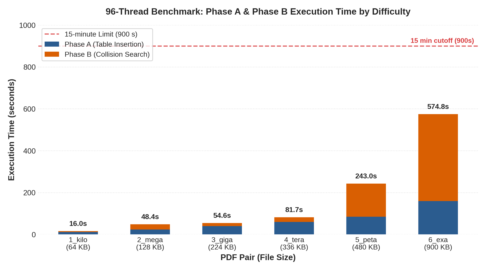

# Brute-Forcing `toy_hash` Collisions with OpenMP

**Author:** Yashwardhan Laharia  
**Student ID:** 24295462

## 1. Introduction

The program applies a birthday attack to find PDF nonces that collide under
the supplied 48-bit `toy_hash`. It stores file-A hashes, then searches file-B
hashes using OpenMP and a partitioned table.

**Overall result:** [TBD]

## 2. Birthday-Attack Algorithm

Assuming independent, approximately uniform outputs, sets containing $N_A$
and $N_B$ hashes have cross-match probability
$1-e^{-N_A N_B/2^{48}}$. Equal sets reach 50% probability at
$N_A=N_B=\sqrt{\ln(2)2^{48}}\approx1.40\times10^7$, or about
$2.79\times10^7$ total hashes. The actual collision location for each input
pair is fixed because the implementation searches deterministic nonce ranges.

Phase A inserts `(hash, nonce_a)` pairs into a collision table. Phase B
generates `(hash, nonce_b)` pairs and queries that table. A match supplies the
two candidate nonces, which the caller independently verifies before writing
either solved file.

**Collision table:** Each open-addressing entry stores a hash, its file-A
nonce, and an occupancy flag. A multiplicative index is masked by
`capacity - 1`, so capacities are powers of two; collisions use linear
probing. The serial table has $2^{25}$ entries for $2^{24}$ A trials, limiting its
planned load to 50% and reducing probe lengths.

**Search ranges:** Phase A hashes nonces zero through $2^{24} - 1$. With that
table, the expected B probes before a match are $2^{24}$, giving approximately
$2^{25}$ total hash calls. Phase B searches in consecutive $8 \times 2^{24}$-nonce
batches while reusing the A table. The first batch has expected cross-match
count eight and success probability $1 - e^{-8} = 99.97%$; if needed, searching
continues with the next non-overlapping batch until a match or exhaustion of
the 64-bit nonce space.

## 3. Parallelisation and Synchronisation

The serial attack is the correctness and speedup baseline. The OpenMP version
parallelises independent nonce trials rather than the sequential operations
inside each `toy_hash` call.

**Work assignment:** Phase A uses `omp for schedule(static)`, assigning each
nonce once. Phase B uses guided scheduling over fixed $2^{16}$-nonce chunks so
threads can stop between chunks after a collision is found. Hashes are routed
to one of `T` partitions using `hash % T`, where `T` is the actual OpenMP team
size. Each partition is sized to the next power of two at least twice its
expected share of A hashes.

**Synchronization:** During phase A, one OpenMP lock per partition protects
entries and the shared entry count. A barrier completes every insertion before
phase B, when the tables are read-only and require no locks. A C11 atomic
compare-and-exchange on `found` selects exactly one thread to publish the
solution; completion of the parallel region synchronizes that result with the
caller.

**Rationale:** Partitioning gives one deterministic phase-B lookup instead of
searching `T` thread-owned tables. Per-partition locks avoid one global critical
section, although phase-A hashes targeting the same partition can contend.
Static scheduling has low overhead in Phase A because trials perform similar
work; guided scheduling in Phase B helps manage early termination.

**Termination:** Phase B assigns $2^{16}$-nonce chunks. Threads check atomic
`found` within each chunk and stop hashing after a winner publishes the
solution. After the worksharing barrier, one thread updates `stop_search`; the
implicit `single` barrier makes every thread enter and leave each batch
consistently, avoiding divergent worksharing control flow.

## 4. Memory Usage and Trade-offs

The table dominates memory use. On the target 64-bit build, alignment makes
each entry 24 bytes. The serial $2^{25}$-entry table therefore occupies
805,306,368 bytes (768 MiB), excluding two working PDF copies.

In parallel, each of `T` partitions has capacity
`next_power_of_two(2 * ceil(2^24 / T))`. At 96 threads this is $2^{19}$ entries
per partition, or 1.125 GiB of table storage. Each thread also owns two PDF
buffers, making file size relevant to total memory.

The 50% planned load spends memory to shorten linear probes. Partition locks
add phase-A synchronization but enable one lock-free phase-B lookup. Reusing
the A table for further B batches increases search time without increasing
table memory.

## 5. Performance Results and Analysis

Timing covers the complete attack routine, including table setup and cleanup,
but excludes input loading, final verification, and output writing. Benchmark
runs omit optional `--progress` reporting and its synchronization overhead.
Measurements used [TBD] Kaya node, [TBD] compiler/OpenMP configuration,
[TBD] repetitions, and the [TBD] summary statistic. Because every trial hashes
the complete PDF, larger inputs should cost more per trial even though the
expected trial count is governed by the 48-bit collision probability.

### 5.1 Completion Results

The completion table reports the mean of 3 runs at 96 threads. Phase A,
Phase B, and total times are measured by the program; the maximum total is used
for the 15-minute check.

| Pair | Threads | Phase A mean (s) | Phase B mean (s) | Total mean (s) | Maximum total (s) | Under 15 min? |
| --- | --- | --- | --- | --- | --- | --- |
| `1_kilo` | 96 | 11.72 | 4.27 | 16.11 | 16.12 | Yes |
| `2_mega` | 96 | 22.94 | 25.41 | 48.47 | 48.49 | Yes |
| `3_giga` | 96 | 39.82 | 14.80 | 54.75 | 54.75 | Yes |
| `4_tera` | 96 | 59.50 | 22.17 | 81.81 | 81.82 | Yes |
| `5_peta` | 96 | 84.81 | 158.20 | 243.14 | 243.17 | Yes |
| `6_exa` | 96 | 158.83 | 415.98 | 574.95 | 575.49 | Yes |

### 5.2 Scaling Results

The thread-scaling experiment uses the `1_kilo` pair and three sequential
repetitions at each thread count. Times below are [TBD] total
search times in seconds.

| Threads | Phase A Mean (s) | Phase B Mean (s) | Total Mean (s) |
| --- | --- | --- | --- |
| 1 | [TBD] | [TBD] | [TBD] |
| 2 | [TBD] | [TBD] | [TBD] |
| 4 | [TBD] | [TBD] | [TBD] | 
| 8 | [TBD] | [TBD] | [TBD] |
| 16 | [TBD] | [TBD] | [TBD] |
| 32 | [TBD] | [TBD] | [TBD] |
| 64 | [TBD] | [TBD] | [TBD] |
| 96 | [TBD] | [TBD] | [TBD] |

**Speedup and efficiency:** Speedup is calculated relative to the one-thread
mean: $S_T=[TBD]$. Parallel efficiency is $E_T=[TBD]$. The point where
additional threads stop producing useful speedup is [TBD].

**Difficulty comparison:** At 96 threads, the slowest pair is [TBD] and the
fastest pair is [TBD]. The results show [TBD] relationship between PDF size and
per-trial cost. Any non-monotonic ordering is explained by [TBD] variation in
the Phase B stopping position and system noise.

**Performance conclusion:** The best measured configuration is [TBD]. The
maximum observed speedup is [TBD], and all six pairs [TBD] the 15-minute
per-pair requirement.

## 6. Conclusion

The project demonstrates a birthday attack against a weak 48-bit hash and a
parallel implementation using OpenMP. [TBD]
